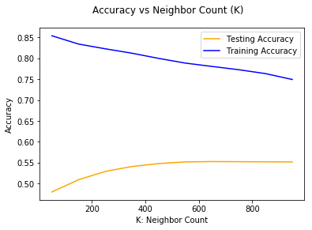
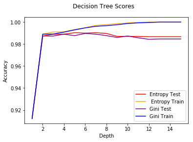
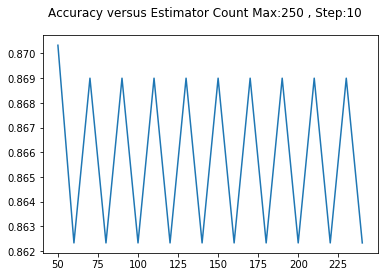
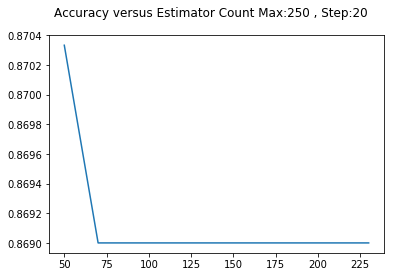
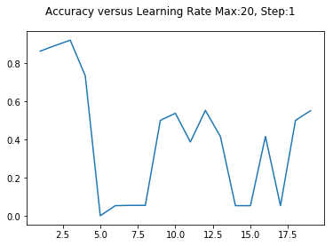
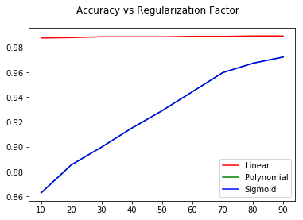

# SDSS-Machine-Classifiers
Using Various Machine Learning Classficiation Algorithims on the Sloan Digital Sky Survey DR 14 to figure out which is the best

## Data Overview
The data is from the Sloan Digital Sky Survey Data Release-14 (SDSS-DR14). Processing the raw data left 6 features with three targets, Stars, Galaxies, and Quasars.

## Machines/Modles used so far

-K Nearest Neighbors

-Decision Trees

-ADABoost Ensemble

-Support Vector Classifier

## Graphs

### KNN 

</img>

### Decision Tree
</img>

### ADABoost

</img>
</img>
</img>
          
### Support Vector Classifier

</img>
